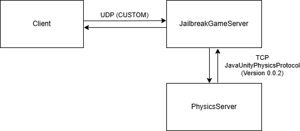
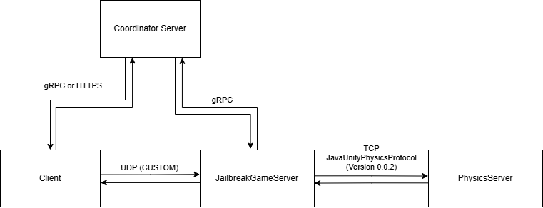

# 🎮 Jailbreak — Game Server

> Game server with Java game logic and implemented Unity physics simulation. Code name of project: Jailbreak. Date of last update: 12.09.2025.


---

## 🧠 Architecture Overview

This server uses a **dual-runtime architecture**:

| Layer | Technology | Responsibility |
|---|---|---|
| **Game Logic** | Java | Sessions, players, game rules, networking, state management |
| **Physics** | Unity (Headless) | Physics simulation, collision detection, world state |



One of the possible future implementations:



Runtime demonstration:
> [Runtime](https://youtu.be/OO3shuYUTvg)

---

## ✨ Features

- ⚡ Low-latency networking via Java (custom protocol)
- 🧱 Authoritative server-side physics via Unity headless
- 🔄 Tick-based game loop with deterministic state sync
- 👥 Multi-session / multi-room support
- 📊 Built-in metrics and logging

---

## 📦 Requirements

### Java Core
- Java **11+**
- Maven

### Unity Physics Worker
- Unity **6.2** (headless build)
- Platform: Linux x64 / Windows x64

---

## 🚀 Getting Started

### 1. Clone the repository

```bash
git clone https://github.com/VER7U7/JailbreakGameServer.git
cd JailbreakGameServer
```

### 2. Open Unity Physics Worker

```bash
# Open the /unity-physics folder in Unity Editor
```

### 3. Open Java Server

```bash
# Open the /JailbreakServer folder in editor
```

### 4. Build & run Java Core

```bash
# Maven
mvn clean package
java -jar target/JailbreakServer.jar
```

Both parts need to be started manually.

---

## ⚙️ Configuration

The following parameters are currently set:

```yaml
server:
  clients_port: 5000
  bridge_port: 6767
  tick_rate: 64          # Game loop ticks per second

physics:
  bridge_port: 6767      # Internal Java ↔ Unity communication port

logging:
  level: DEBUG            # DEBUG / INFO / WARN / ERROR
```

---

## 📁 Project Structure

```
JailbreakServer/            
├── src/	      # Java game server
│   ├── Core/         # Head of server
│   ├── Gameplay/     # Game rules, Entities, Game objects
│   ├── Network/      # Network, States
│   ├── Packets/      # Packets data, Handlers
│   ├── JUPP/         # Old version JavaUnityPhysicsProject
│   └── Main.java     # Main
└── pom.xml
│
└── JailbreakPhysicsServer/           # Unity headless physics worker
```

---

## 📡 Client Integration

The client (Unity game) connects to the Java server via `host:5000` (Can be changed).  
Client repository: [soon]  

---

## 🛣️ Roadmap

- [+] Project archived

---

## 🤝 Contributing

1. Project has been archived. Commits wont be accepted.

---

## 📄 License

This project is licensed under the **MIT License**.

See the [LICENSE](LICENSE) file for details.
---
